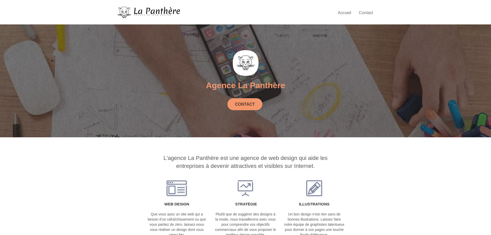
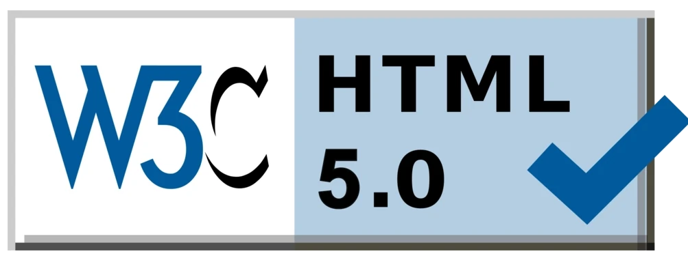

<h3 align="center">
	Quatrième projet du parcours "Développeur web" chez OpenClassroom.
</h3>

[Lien vers le site](https://jzmirou.github.io/La-Panthere/)

## **Technologies**

 
	
	
	

## **Lighthouse PageSpeed Insights**

\

## **W3C Validateur**

## **Auteurs**

<b>
<table>
	<tbody>
		<tr>
			<td align="center">
				
				 
				Jeremy Zmirou
				 
				
				
				
				
			</td>
		</tr>
	</tbody>
</table>

## :dart: Objectifs attendus

-   Analyse de l’état actuel du SEO du site fourni.
-   Amélioration du SEO du site.
-   Comparaison des résultats.

## :white_check_mark: Compétences évaluées

-   Assurer l'accessibilité d'un site web
-   Réaliser une recherche des bonnes pratiques en développement web
-   Optimiser le référencement d'un site web
-	Optimiser la taille et la vitesse d’un site web
-	Écrire un code HTML et CSS maintenable
